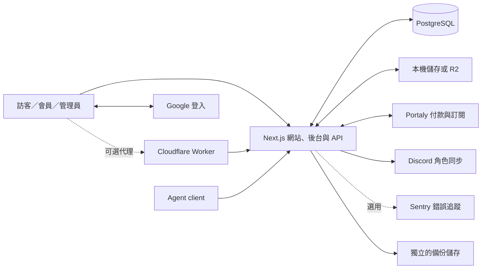
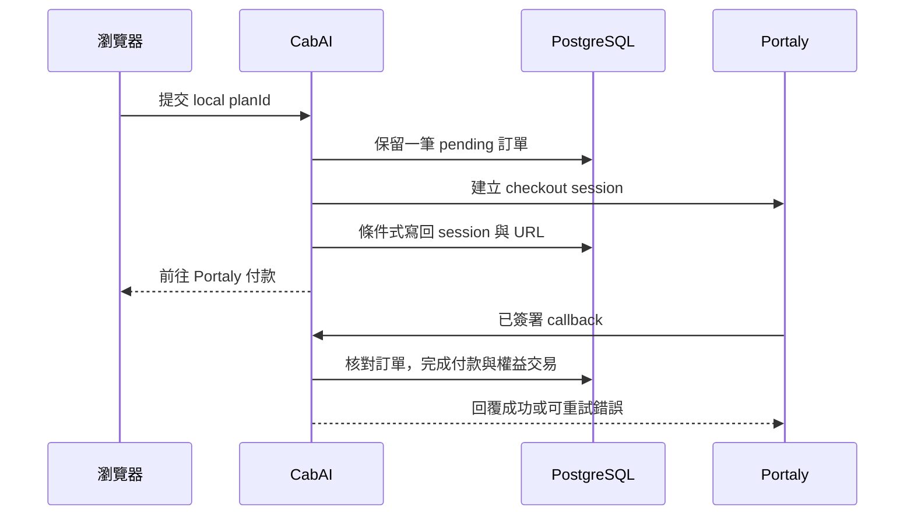

# 系統架構

CabAI 是一個 Next.js 應用程式：同時提供網站、管理後台與 API，主要資料放在 PostgreSQL，教材檔案放在本機儲存或 R2。這份文件用來理解請求經過哪些模組；要找檔案位置，搭配[模組地圖](MODULE-MAP.md)閱讀。

## 系統拓樸

Worker 是另外部署的選用元件，負責轉送請求、維護頁和監控；它不處理資料庫，也不代替應用程式的權限檢查。

## 程式怎麼分工？

| 層級 | 位置 | 負責什麼 |
|---|---|---|
| 頁面與元件 | `src/app/**/page.tsx`、`src/components` | 顯示資料、收集輸入、呼叫 action 或 API。 |
| HTTP 路由 | `src/app/api/**/route.ts` | 解析請求、驗證身分、限制頻率、回傳結果。 |
| Server Actions | `src/app/**/actions.ts`、`src/actions` | 接收瀏覽器操作，將輸入交給對應服務。 |
| 查詢 | `src/lib/queries` | 組合頁面或 API 需要的資料。 |
| 功能服務 | `src/lib/services` 及訂單、權益等服務 | 實作修改規則、交易、版本和稽核紀錄。 |
| 資料庫 | `src/lib/db`、`drizzle/` | Schema、查詢關聯、migration 和鎖定。 |
| 外部服務 | Portaly、Discord、storage、observability adapters | 處理各服務的格式、連線、逾時和錯誤。 |
| 維運 | `src/lib/jobs`、`src/lib/database-backup`、`scripts/` | 排程、健康檢查、備份、migration 和 Doctor。 |

主要方向是「頁面／API → 查詢或服務 → 資料庫／外部服務」。部分舊頁面仍直接查詢或觸發同步，修改前需確認呼叫關係。特殊 callback、串流、檔案與重新導向路由有各自的回應格式，清單在 `docs/contracts/api-route-boundaries.json`。

## Request 與授權邊界

- **訪客**只能讀取已公開的頁面與內容。
- **會員**使用 Auth.js session；課程、檔案和商品權限由伺服器查詢本地資料判斷。
- **管理員**除了登入，操作時還要重新確認資料庫中的 `users.role`，避免舊 session 保留已撤銷的管理權限。
- **Agent**使用資料庫簽發的 key/token，依 scope 和資源權限執行；資料庫只保存 key 的雜湊。
- **排程與詳細健康檢查**使用 `Bearer CRON_SECRET`；服務權益查詢使用綁定方案的 `x-service-key`。
- **付款 callback**先驗證簽章、時間與事件，再核對本地訂單、金額和幣別。舊 Marketplace 入口已停用，詳見[設定說明](../development/CONFIGURATION.md#legacy-marketplace-unavailable-in-the-first-release)。
- **私有檔案**依媒體登錄和存取權限提供內容，或發出有期限的簽署連結。

`src/middleware.ts` 主要做登入導向；頁面、API 和服務仍各自檢查需要的權限。Client-IP 限流預設不信任轉送標頭，啟用方式見[代理設定](../development/CONFIGURATION.md#client-ip-trust)。

## Core control flows

### 付款與授權

向 Portaly 發出 HTTP 請求時不占住資料庫交易。訂單完成、會員權益和待同步事件一起提交，再由背景工作處理 Discord 與外部 webhook。重送事件不應重複授權，詳細規則見[資料流程](DATA-AND-FLOWS.md)與[付款規格](../contracts/payment-entitlement-reliability.md)。

### 背景工作

Node 啟動流程呼叫 `scheduleRegisteredJobs`，由 `runJob` 取得鎖定、執行工作並寫入 `jobRuns`。Readiness 會檢查工作是否持續成功。內建排程與外部 runner 擇一使用，避免多個執行者重複發送通知或寫入備份。

### 來源站失效

Cloudflare Worker 對每個請求最多連到來源站一次。符合條件的 HTML 頁面會改顯示 503 維護頁；API、callback 和其他操作保留各自的錯誤格式。監控狀態放在 Durable Object，與應用程式資料庫分開。

## 修改時特別注意

| 修改位置 | 會一起影響 |
|---|---|
| `checkPlanAccess`、`checkCourseAccess` | 商品、會員頁、課程、檔案與 Agent 讀取。 |
| `completeOrder`、`entitlement-transitions.ts` | 付款、對帳、授權、撤權和後續同步。 |
| `withApiHandler` | 共用 API 的錯誤格式、request ID 和錯誤追蹤。 |
| `course-service.ts`、`course-publish.ts` | 後台與 Agent 的課程修改；發布另有檢查和交易。 |
| 排程／runtime 設定 | 工作是否啟動、是否重複，以及 readiness 判斷。 |
| Migration／備份 | 已有資料的相容性與可還原性。 |

## 後續可以改善的地方

- 部分大型頁面與服務仍負責多種行為；有實際修改需求時，再按功能規則拆分。
- Outbox 目前依送出時的本地資料產生內容。若要保留完整歷史事件，需另外設計不可變快照。
- 記憶體限流不會跨副本共享。多副本部署需要自己的限流與排程方案。
- 新增外部服務時，先補逾時、重試、錯誤與測試，再考慮是否需要通用介面。
