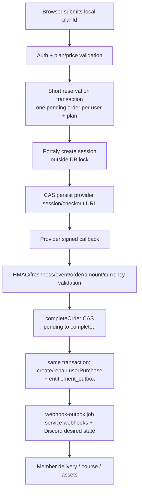
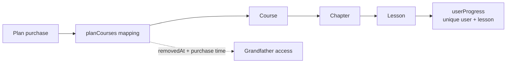

# Data and Flows

這裡說明資料存在哪裡、付款如何變成會員權限，以及背景工作與備份怎麼配合。

## Schema 概覽

資料表定義在 `src/lib/db/schema.ts`，遷移順序在 `drizzle/meta/_journal.json`。下表按用途整理主要資料：

| Domain | Tables |
| --- | --- |
| Auth (4) | `users`、`accounts`、`sessions`、`verificationTokens` |
| Commerce / delivery (7) | `plans`、`planContents`、`orders`、`userPurchases`、`entitlementOutbox`、`serviceConfigs`、`webhookLogs` |
| Course / content / revision (10) | `courses`、`planCourses`、`chapters`、`lessons`、`userProgress`、`media`、`auditLogs`、`contentRevisions`、`operationSnapshots`、`planPresentations` |
| API / integration / operations | `agentApiKeys`、`userApiTokens`、`portalyProductMappings`、`portalyMarketplaceEvents`、`userDiscordLinks`、`discordRoleMappings`、`siteConfig`、`jobRuns`、`eventsRaw`、`rateLimitWindows`、`providerSyncChangeSets`、`providerSyncJobs` |
| Library / Skill / Information | `libraryEntries`、`skills`、`skillReleases`、`agentInformationItems`、`agentInformationEvents`、`userAgentInformationReads` |

Migration 依 journal 的順序套用。`0010_premium_blindfold.sql`是未進canonical journal的歷史orphan，由exception registry精確允許；不得把這種例外擴大成任意跳過migration。

## Sources of truth

| 概念 | 權威資料 | 不是授權證據 | 備註 |
| --- | --- | --- | --- |
| Local Plan identity | `plans.id` | provider plan ID | `providerPlanId`只是供應商映射 |
| 展示型別與內容 | `planPresentations` | Portaly plan copy | sync不應覆蓋local presentation |
| 交付組成 | `planCourses`、`planContents`、`serviceConfigs` | checkout redirect | course removal保留`removedAt`供grandfather access |
| 付款證據 | bound `orders` + callback validation | browser success URL | amount/currency/mode/customer/order binding需驗證 |
| 目前Plan權限 | active `userPurchases` + order/subscription validity | 單一provider payload、offering type | `checkPlanAccess`是主要decision owner |
| Course權限 | Plan權限 + active/grandfather `planCourses` | course public ID | `checkCourseAccess`整合mapping與purchase時間 |
| Lesson進度 | `(userId, lessonId)`唯一`userProgress` | client state | 完成/續看由local DB讀取 |
| Job健康 | `jobRuns`最後成功／失敗與freshness | process還活著 | silent scheduler death透過readiness偵測 |
| DB備份 | committed manifest + verified artifact | `operationSnapshots` | object media binary不在pg_dump內 |

## 付款與授權主流程

### 已確認的保護

- checkout以`(userId, planId)`短期reservation lock與partial unique index確保單一pending order；provider HTTP不在DB transaction內。
- callback只接受簽章、freshness、mode、order binding、amount/currency通過的付款證據。
- `completeOrder`使用conditional update/CAS，並在同一transaction建立purchase與durable entitlement transition；replay走冪等路徑。
- 無效或不可重試callback回provider-safe `200`；已驗證但核心處理失敗回`500`，讓provider可重試。
- cancel/resume、full/Admin/Agent reconciliation、rebuild、Marketplace、free claim與manual grant/revoke都經`entitlement-transitions.ts`；subscription `past_due`可暫停後恢復，period-end cancellation以`cancelEffectiveAt ?? nextBillingAt`作paid-through邊界，兩者都缺時fail closed，terminal state才永久revoked。
- `localPaymentOrderGrantsAccess`由content、Discord與external entitlement list共用，避免三套有效性規則漂移。

### 一致性設計與改善空間

1. checkout live initialization不再被第二request標failed；late provider response不能復活已失效reservation。
2. grant/revoke state與`entitlementOutbox`同transaction，consumer可重試、dead-letter並由Admin重新排程。
3. Subscription 更新透過 durable transition；Legacy Marketplace 的未驗證事件不由通用重試處理，需管理員核對供應商匯出資料後才匯入。
4. self-heal使用`providerPlanId ?? localPlanId`、保存完整subscription evidence，並拒絕跨user/plan identity conflict。
5. **Residual / Recommended:** `subscriptionId`仍無DB unique constraint；程式會fail closed於跨owner conflict，但若要加constraint需先做production duplicate audit與forward migration。
6. **Residual / Recommended:** outbox delivery payload在consumer處由current rows組裝，還不是immutable event snapshot；不影響本輪state/delivery可恢復性，但歷史稽核語意可再加強。

## Free claim

`/api/checkout/free-claim`驗證plan後建立`source=free_claim` purchase，不建立order。partial unique index避免同一user/plan重複active free claim；purchase與grant transition同transaction，與Marketplace／callback使用同一consumer矩陣。

## Course與progress

- Publish前有readiness與revision，transaction內更新course、active lessons與linked presentations。
- Readiness snapshot在transaction外；並行編輯可能讓已驗證狀態和commit時資料不同（**Inferred Medium**）。
- Admin Course CRUD／archive 只透過 `course-service.ts` mutation；active-purchase delete guard 由 Admin／Agent 共用，並有 integration／component evidence。
- `userProgress`是進度權威；client UI不應自行推導完成狀態。

## Entitlement transition與Webhook outbox

`entitlementOutbox`是domain transition queue：local state與event同transaction；processor分別記錄service webhook enqueue與Discord desired-state完成，最多5次後dead-letter。Admin `/admin/webhooks`可檢視並重試未完成transition，已完成的consumer marker不會重做。

`webhookLogs.idempotencyKey` unique；processor先以conditional update claim，lease約10分鐘，最多5次；2xx成功、4xx dead-letter、5xx／network retry，DNS、connect 與 response 共用單次 10 秒 deadline。Outbound HTTPS 只解析一次並固定通過檢查的 IP，保留原 hostname 的 Host/SNI/TLS 驗證且不跟隨 redirect；redirect 依原 retry policy 處理。拒絕 private/reserved、IPv4-mapped/transition IPv6、URL credentials/fragment 與 mixed-private DNS answers。2xx 不讀 body；非 2xx body 最多 64 KiB，超量時丟棄 body 並保留 status 分類（4xx 仍立即 dead-letter）。語意是**at-least-once**：remote成功後process在`markSent`前crash會重送，receiver必須依idempotency key去重；目前無法由Repository證明所有receiver都做到。

連線會固定在已驗證的 IP，避免 DNS 在檢查後變更目的地；詳細條件見[設定說明](../development/CONFIGURATION.md#outbound-service-webhook-destinations)。

## Jobs與一致性

| Job | Default in-process schedule | State/lock | 主要副作用 |
| --- | --- | --- | --- |
| `database-backup` | 每30分鐘 | advisory lock + `jobRuns` | pg_dump至local/private R2；只在capability enabled |
| `cleanup-orders` | 每小時 | 同上 | expired pending orders |
| `media-cleanup` | 每小時第10分 | 同上 | orphan media metadata/object cleanup |
| `webhook-outbox` | 每5分鐘 | 同上 | entitlement transitions、Discord desired state、external delivery/retry/DLQ |
| `subscription-reconciliation` | 每日06:00、18:00 | 同上 | provider status、local revoke與external side effects |
| `provider-sync` | 每分鐘 | 同上 | 處理供應商同步工作 |

Schedule來自`src/lib/jobs/scheduler.ts`。外部模式必須由authenticated cron或runner承接；`vercel.json`目前GET/頻率與POST-only routes不一致，不可視為canonical runner。

## Backup、snapshot與media

| 機制 | 覆蓋 | 不覆蓋 | 恢復用途 |
| --- | --- | --- | --- |
| PostgreSQL backup | 全DB plain SQL gzip、migration tag、hash/manifest | local/R2 media binary | 隔離空白DB restore drill、production recovery素材 |
| Media storage | object binary + `media` metadata分離 | DB backup只含metadata/key | 需要獨立object backup／retention policy |
| `operationSnapshots` | 特定operation前JSONB snapshot | 完整DB、所有side effects、原本空table | emergency/limited rollback helper；非正式backup |

`DB_BACKUP_KEEP`由`database-backup/retention.ts`嚴格解析：未設定使用336，配合30分鐘排程形成7天歷史；明確值必須是safe integer且至少3。錯誤值在建立sink／dump／刪除前fail closed，`applyRetention`也防守direct caller。

## 敏感資料與治理

- `users`、orders、purchases、Discord link、events與webhook payload可能包含身份／付款相關資訊。
- DB-issued API keys只存hash；Sentry events以allowlist/scrub重建。
- Outbound entitlement payload可含email/name；是否需要最小化與獨立signing secret是owner/security決策。
- Repository、logs、evidence不得保存DSN、token、DB URL、raw callback、customer資料或production resource ID。
- `scripts/.content-sync-cache.json` 是被 Git 排除的本機同步狀態，不隨原始碼發布。

## 代表性驗證

- `src/lib/__tests__/order-lifecycle.integration.test.ts`
- `src/app/api/callback/route.contract.test.ts`
- `src/lib/__tests__/access.integration.test.ts`
- `src/lib/__tests__/checkout-reservation.integration.test.ts`
- `src/lib/__tests__/entitlement-outbox.integration.test.ts`
- `src/lib/__tests__/subscription-entitlement.integration.test.ts`
- `src/lib/__tests__/course-access.integration.test.ts`
- `src/lib/__tests__/webhook-outbox.integration.test.ts`
- `src/lib/jobs/job-ledger.integration.test.ts`
- `src/lib/database-backup/*.test.ts`

剩餘測試提升空間包括outbox crash-window完整matrix、mapping/default-role大批量rate behavior、provider sandbox與production migration/deploy evidence。

本文件在table、migration、source of truth、transaction boundary、job、backup或entitlement副作用改變時更新。
